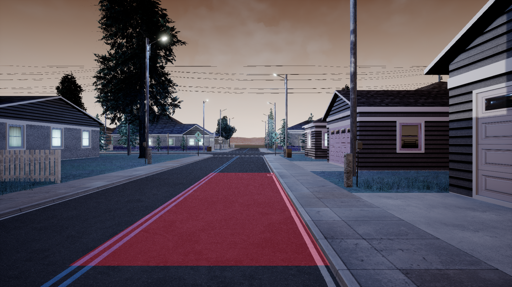

# Lane Detection
MP1 files for ECE 498 **principles of safe autonomy**


> Instructions to complete individual Machine Problems will be in the individual MP [README](src/mp1/README.md) files

## Details of Code development are inside jupyter file (.ipynb). 

## Run the code
Complete the following steps
1. In the terminal window type the following
```
nvidia-docker run --name $USER --env="DISPLAY" -e "KEY=9d171875ae52d6b33b0487e8a7accd32d94850278473e36ca594b87105205c8a438cfb30df390caa8116b9cbd2e7e7da0d3767cbcada8712c7a03836f3e53a066c7b3432ef5c105049bb66542535f66e97fde5a5c714342b9db20883611c1f4c251bf8e89aa80ae30ba1d9e06885c372a72e4346f23ea3daee8014658691d328" -e "PORTAL_URL=https://illini.righthook.io" -v /tmp/.X11-unix:/tmp/.X11-unix:rw -v /usr/lib/x86_64-linux-gnu/libXv.so.1:/usr/lib/x86_64-linux-gnu/libXv.so.1 --ulimit nofile=65535:65535 rh_sim/minimaps:c000140725e017ab00810eea6ab55e1cc9310182
```

2. Start a new terminal and clone this repository
```
git clone https://gitlab.engr.illinois.edu/GolfCar/mp1-release.git
```
3. change directory to this repository 
```
cd mp1-release
```
4. run ros set configuration files. Please make sure to enter your netId in the setup.sh file
```
source setup.sh
```
5. build the ros repository
```
catkin_make
```
6. start the simulation 
```
./run.sh
```
7. run the ROS code
```
source devel/setup.bash
roslaunch mp1 run_mp.launch
```
8. Kill the simulation after you are done.
```
./kill.sh
```
9. Kill the docker container after you are done with your code. 
**Note: IT is important to run this command so that you do not any issue the next time you run right-hook**
```
docker stop $USER
docker rm $USER
```
**To understand the ROS code go through the file [BASICS.md](./BASICS.md)


